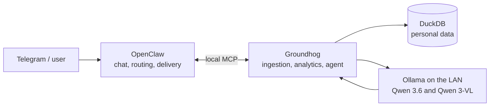

Groundhog is not an OpenClaw plugin. Groundhog is the local personal-data
system; OpenClaw is the chat and delivery layer around it. Groundhog keeps the
database, ingestion, analytics, and AI inside the home LAN, while OpenClaw
handles the conversational interface and delivery.



Groundhog owns the facts. OpenClaw makes them convenient to use.

## What Groundhog does

Groundhog collects stock prices, sleep data, workout plans, activity results,
reminders, and memory in a local DuckDB database. Its ingestion jobs are
idempotent, so re-running an import does not duplicate data.

It also calculates SMA 50/200 and daily/weekly Supertrend signals, then records
deduplicated alerts. OpenClaw can decide whether and where to deliver them.

All AI stays local through Ollama. Groundhog uses the open-source Qwen 3.6
model for text and data questions, Qwen 3-VL for screenshot extraction, and
`nomic-embed-text` for memory embeddings. These models run on our LAN, so
personal health, sleep, workout, and memory data do not leave it.

No health, sleep, workout, or memory data is sent to OpenAI, Anthropic, or a
hosted model API.

## Ask Groundhog

`/ask` is the conversational front door:

```
/ask What was AAPL's latest closing price?
/ask What is my latest sleep summary?
/ask Show my most recent workout plan.
```

OpenClaw routes the request to Groundhog's local `ask_groundhog.py` entrypoint.
Groundhog's agent retrieves the answer through MCP tools backed by DuckDB, then
returns the result to OpenClaw for delivery. The model is tool-bounded and the
database remains the source of truth.

The same separation applies to screenshots: OpenClaw receives the attachment;
Groundhog imports it deterministically with its local vision model.

## Why the split matters

OpenClaw does not need direct database access, SQL schema knowledge, or a copy
of the personal-data logic. Groundhog does not need to know about Telegram or
chat delivery. MCP is the explicit contract between them.

Groundhog decides what happened. OpenClaw decides how to talk about it.
