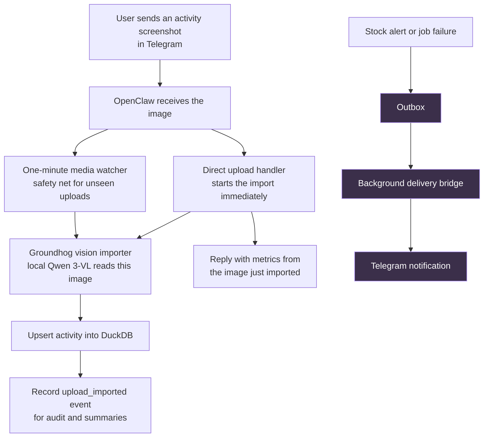

Telegram image uploads look immediate from the chat, but they involve two
separate paths: importing the image into Groundhog and sending a message back
to Telegram. Keeping those paths distinct is useful, but it also means their
timing must be handled carefully.

## The important distinction

The image-import path is tied to one specific attachment. Groundhog reads that
file with the local vision model, extracts its visible metrics, saves the
activity, and the direct handler can respond with those exact metrics.

The outbox path is different. It is intentionally asynchronous: a background
job later sends durable operational notifications such as stock alerts. It
does not know which image message is currently open in the Telegram chat, and
it cannot reply to an individual attachment.

## Why an old activity summary appeared beside a new image

Previously, successful image imports also added an “Imported activity” message
to the outbox. Vision extraction can take minutes. If an older image completed
after a newer one had arrived, the background delivery job could send the
older message near the newer image. The extracted facts were correct, but the
placement made the message look like it described the wrong screenshot.

## The fix

Image imports still create a durable `upload_imported` event, so Groundhog has
an audit trail and daily summaries can include the import. They no longer add
a background Telegram message to the outbox.

That leaves each channel with one clear responsibility:

- The direct upload handler replies only about the image it just imported.
- The periodic watcher silently imports any attachment the direct handler did
  not process.
- The outbox remains for notifications that are genuinely independent of a
  particular chat message, such as stock alerts and job failures.

The result is a more trustworthy conversation: no delayed activity result can
masquerade as the reply to a later screenshot.
